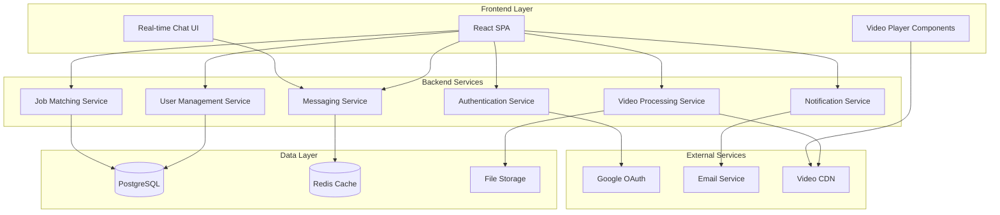

# Design Document

## Overview

RapidGig is a modern web application that combines traditional job matching with social media-inspired video content discovery. The platform uses a microservices-inspired architecture with a React frontend, Node.js backend, and cloud-based video processing to deliver a seamless experience for both students and recruiters.

The design emphasizes rapid user interactions (30-second application process), real-time communication, and engaging video content discovery similar to TikTok or Instagram Reels.

## Architecture

### High-Level Architecture



### Technology Stack

**Frontend:**
- React 18 with TypeScript
- Tailwind CSS for styling (implementing the provided color scheme)
- React Router for navigation
- Socket.io-client for real-time messaging
- React Query for state management and API caching
- Video.js or similar for video playback

**Backend:**
- Node.js with Express.js
- TypeScript for type safety
- Socket.io for real-time communication
- JWT for authentication
- Multer for file uploads
- Bull Queue for background job processing

**Database & Storage:**
- PostgreSQL for primary data storage
- Redis for session management and real-time features
- AWS S3 or similar for video/image storage
- CloudFront or similar CDN for video delivery

## Components and Interfaces

### Frontend Components

#### Authentication Components
- `LoginForm`: Split-screen login with email/password and Google OAuth
- `SignUpForm`: Registration with student/recruiter toggle
- `ForgotPasswordForm`: Password reset functionality
- `AuthGuard`: Route protection component

#### Core Application Components
- `Navbar`: Main navigation with role-based menu items
- `VideoPlayer`: Custom video player with autoplay and controls
- `JobCard`: Reusable job listing component
- `ProfileCard`: User profile display component
- `ChatWindow`: Real-time messaging interface
- `NotificationCenter`: In-app notification management

#### Page Components
- `HomePage`: Hero banner, nearby gigs, category explorer
- `ShortsPage`: Video grid with filters and infinite scroll
- `JobsPage`: Job listings with advanced filtering
- `ProfilePage`: Tabbed profile interface
- `MessagesPage`: Chat list and conversation view

### Backend API Endpoints

#### Authentication Endpoints
```
POST /api/auth/register
POST /api/auth/login
POST /api/auth/logout
POST /api/auth/forgot-password
POST /api/auth/reset-password
GET /api/auth/google
```

#### User Management Endpoints
```
GET /api/users/profile
PUT /api/users/profile
GET /api/users/:id
POST /api/users/upload-avatar
```

#### Job Management Endpoints
```
GET /api/jobs
POST /api/jobs
GET /api/jobs/:id
PUT /api/jobs/:id
DELETE /api/jobs/:id
POST /api/jobs/:id/apply
GET /api/jobs/applications
```

#### Video Management Endpoints
```
POST /api/videos/upload
GET /api/videos
GET /api/videos/:id
PUT /api/videos/:id
DELETE /api/videos/:id
GET /api/videos/shorts-feed
```

#### Messaging Endpoints
```
GET /api/messages/conversations
GET /api/messages/:conversationId
POST /api/messages
PUT /api/messages/:id/read
```

## Data Models

### User Model
```typescript
interface User {
  id: string;
  email: string;
  password: string; // hashed
  fullName: string;
  role: 'student' | 'recruiter';
  profilePicture?: string;
  createdAt: Date;
  updatedAt: Date;
  
  // Student-specific fields
  skills?: string[];
  university?: string;
  graduationYear?: number;
  
  // Recruiter-specific fields
  companyName?: string;
  companyLogo?: string;
  companyDescription?: string;
}
```

### Job Model
```typescript
interface Job {
  id: string;
  title: string;
  description: string;
  category: string;
  duration: string;
  payRate: number;
  payType: 'hourly' | 'fixed' | 'negotiable';
  location: string;
  workType: 'remote' | 'onsite' | 'hybrid';
  requiredSkills: string[];
  recruiterId: string;
  status: 'active' | 'closed' | 'draft';
  createdAt: Date;
  updatedAt: Date;
}
```

### Video Model
```typescript
interface Video {
  id: string;
  title: string;
  description: string;
  tags: string[];
  category: string;
  duration: number;
  fileUrl: string;
  thumbnailUrl: string;
  userId: string;
  views: number;
  status: 'processing' | 'ready' | 'failed';
  createdAt: Date;
  updatedAt: Date;
}
```

### Application Model
```typescript
interface Application {
  id: string;
  jobId: string;
  studentId: string;
  status: 'pending' | 'reviewed' | 'accepted' | 'rejected';
  coverLetter?: string;
  appliedAt: Date;
  updatedAt: Date;
}
```

### Message Model
```typescript
interface Message {
  id: string;
  conversationId: string;
  senderId: string;
  content: string;
  messageType: 'text' | 'file' | 'system';
  readAt?: Date;
  createdAt: Date;
}
```

## Error Handling

### Frontend Error Handling
- Global error boundary for React component errors
- API error interceptors with user-friendly messages
- Form validation with real-time feedback
- Network error handling with retry mechanisms
- Video upload error handling with progress indicators

### Backend Error Handling
- Centralized error middleware for consistent error responses
- Input validation using Joi or similar library
- Database error handling with appropriate HTTP status codes
- File upload error handling with size and format validation
- Rate limiting to prevent abuse

### Error Response Format
```typescript
interface ErrorResponse {
  success: false;
  error: {
    code: string;
    message: string;
    details?: any;
  };
  timestamp: string;
}
```

## Testing Strategy

### Frontend Testing
- Unit tests for utility functions and hooks using Jest
- Component testing with React Testing Library
- Integration tests for user flows (login, job application, video upload)
- E2E tests using Playwright for critical user journeys
- Visual regression testing for UI consistency

### Backend Testing
- Unit tests for business logic and utilities
- Integration tests for API endpoints
- Database integration tests with test database
- Authentication and authorization tests
- File upload and video processing tests

### Performance Testing
- Load testing for concurrent users
- Video streaming performance tests
- Database query optimization testing
- CDN performance validation
- Mobile performance testing

## Security Considerations

### Authentication & Authorization
- JWT tokens with short expiration times
- Refresh token rotation
- Role-based access control (RBAC)
- Google OAuth integration with proper scope validation
- Password hashing using bcrypt with salt rounds

### Data Protection
- Input sanitization and validation
- SQL injection prevention using parameterized queries
- XSS protection with Content Security Policy
- CORS configuration for API endpoints
- File upload validation and virus scanning

### Video Content Security
- File type and size validation
- Content moderation for uploaded videos
- Secure video URLs with expiration
- Rate limiting for video uploads
- DMCA compliance considerations

## Performance Optimization

### Frontend Optimization
- Code splitting and lazy loading for routes
- Image and video optimization with WebP/MP4 formats
- Infinite scrolling for video feeds and job listings
- Caching strategies with React Query
- Service worker for offline functionality

### Backend Optimization
- Database indexing for frequently queried fields
- Redis caching for session data and frequently accessed content
- Background job processing for video encoding
- CDN integration for static assets and videos
- API response compression

### Video Delivery Optimization
- Adaptive bitrate streaming for different connection speeds
- Video thumbnail generation for quick previews
- Preloading strategies for shorts feed
- Progressive video loading
- Mobile-optimized video formats

## Deployment Architecture

### Development Environment
- Docker containers for consistent development setup
- Hot reloading for frontend and backend development
- Local PostgreSQL and Redis instances
- Mock external services for testing

### Production Environment
- Container orchestration with Docker Compose or Kubernetes
- Load balancing for high availability
- Database replication and backup strategies
- CDN integration for global content delivery
- Monitoring and logging with structured logs

### CI/CD Pipeline
- Automated testing on pull requests
- Code quality checks with ESLint and Prettier
- Security scanning for dependencies
- Automated deployment to staging and production
- Database migration management